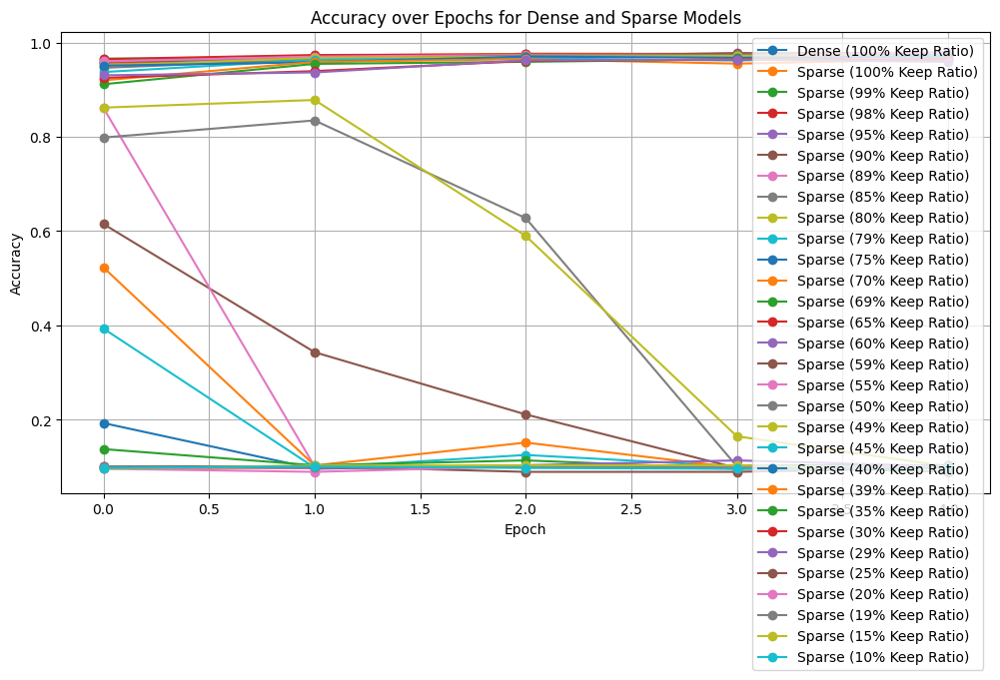
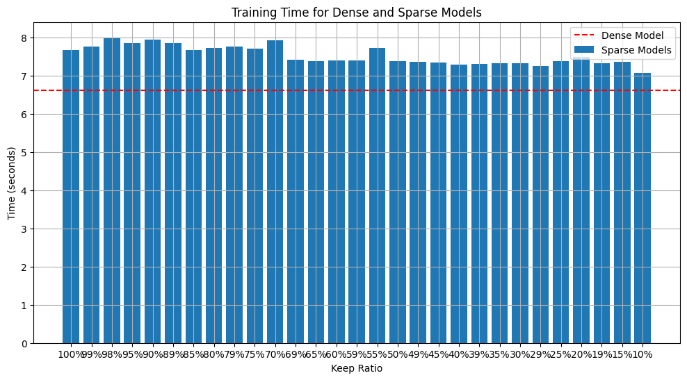

# Stochastic Sparse Backpropagation (SSB)

A research project exploring whether neural networks can learn effectively when only a random subset of neurons participate in gradient computation during backpropagation.

---

# Overview

Traditional neural network training computes gradients for **all neurons and parameters** during the backward pass.

Stochastic Sparse Backpropagation (SSB) investigates a different idea:

> What if only a random subset of neurons received gradients during each training step?

In SSB:

* the **forward pass remains fully dense**,
* all neurons still contribute to predictions,
* but only a stochastic subset of neurons participate in learning during backpropagation.

The long-term goal is to explore whether deep learning systems contain substantial **gradient redundancy**, and whether sparse learning can reduce the computational cost of training while preserving accuracy.


# Graphs
---

The graph displays the accuracy of both the dense model and various sparse models over a series of epochs.


This graph shows the training time for the dense model (as a horizontal red dashed line) and the training times for the sparse models (as blue bars) with different keep ratios. The x-axis represents the keep ratio (the percentage of weights kept during training), while the y-axis represents the training time in seconds. The graph illustrates how the training time changes as the keep ratio decreases, with lower keep ratios generally resulting in shorter training times compared to the dense model.

---

# Core Idea

Standard training:

```text
Dense Forward
    ↓
Dense Backward
    ↓
Update All Parameters
```

Stochastic Sparse Backpropagation:

```text
Dense Forward
    ↓
Sparse Backward
    ↓
Update Only Random Subset of Neurons
```

The key distinction is that sparsity occurs during:

* gradient computation,
* backward propagation,
* learning itself.

NOT during inference or forward propagation.

---

# Research Hypothesis

The central hypothesis of this project is:

$
\text{A substantial fraction of gradient computation may be unnecessary for effective learning}
$

More specifically:
#

$
\text{Neural networks may tolerate significant stochastic sparsity during backpropagation}
$

without catastrophic degradation in accuracy.

---

# Current Implementation

The current implementation uses:

# Neuron-Level Sparse Backpropagation

For a linear layer:
$
W \in \mathbb{R}^{out \times in}
$
each row corresponds to one output neuron.

During each training step:

* a random subset of output neurons is selected,
* only those neurons receive gradients,
* inactive neurons receive zero gradients.

This creates structured neuron-level sparsity.

---

# Current Architecture

The project currently consists of three main files:

| File                      | Purpose                                       |
| ------------------------- | --------------------------------------------- |
| `SparseMLP.py`            | Defines sparse-learning neural network        |
| `SparseLinear.py`         | Defines sparse linear layer                   |
| `SparseLinearFunction.py` | Implements custom sparse backward propagation |

The implementation currently uses custom PyTorch autograd functions to selectively compute gradients for active neurons.

---

# Important Distinction From Dropout

SSB is fundamentally different from Dropout.

## Dropout

Dropout randomly disables neurons during the **forward pass**.

This changes:

* activations,
* network predictions,
* feature co-adaptation.

---

## Stochastic Sparse Backpropagation

SSB keeps the forward pass fully dense.

All neurons still contribute to predictions.

Only learning during the backward pass becomes sparse.

This means:

* inference remains dense,
* representational capacity is preserved,
* sparsity affects optimization rather than activations.

---

# Current Experimental Results

Initial MNIST experiments show:

| Keep Ratio | Accuracy |
| ---------- | -------- |
| 100%       | ~97.7%   |
| 90%        | ~97.5%   |
| 80%        | ~97.1%   |
| 70%        | ~96.4%   |
| 60%        | ~95.9%   |

These results suggest that neural networks can tolerate substantial backward sparsity while maintaining high accuracy.

---

# Critical Sparsity Threshold

One particularly interesting observation is the existence of an apparent sparsity threshold.

Training remains stable down to approximately:
$
\text{keep ratio} \approx 0.60
$
Below this threshold:

* gradients begin exploding,
* optimization becomes unstable,
* learning collapses.

This suggests the possibility of a:

* critical optimization connectivity threshold,
* minimum gradient propagation density,
* sparse learning phase transition.

Understanding this phenomenon is now a major research direction.

---

# Current Limitations

The current implementation achieves:

# Sparse Learning

but NOT yet:

# Sparse Computation

Although inactive neurons do not receive gradients, the implementation still relies on:

* dense tensor allocations,
* dense CUDA kernels,
* dense matrix multiplications.

As a result:

* training time is not significantly reduced,
* sparse training is currently slightly slower due to masking overhead.

This project currently studies:

$
\text{optimization sparsity}
$

rather than true:

$
\text{computational sparsity}
$
---

# Current Development Stages

## Stage 1 — Stable Sparse Learning

Current stage.

Goals:

* validate stochastic sparse learning,
* study convergence behavior,
* identify sparsity thresholds,
* measure accuracy degradation.

Techniques:

* custom autograd,
* neuron-level sparsity,
* stochastic neuron selection.

---

## Stage 2 — Structured Sparse Backward

Future work.

Goals:

* reduce backward-pass computation,
* implement structured sparse gradient propagation,
* reduce unnecessary matrix operations.

Potential techniques:

* block sparsity,
* sparse Jacobian computation,
* structured sparse GEMMs.

---

## Stage 3 — True Sparse Compute

Long-term systems research goal.

Goals:

* actual FLOP reduction,
* memory savings,
* training acceleration.

Potential techniques:

* Triton kernels,
* custom CUDA kernels,
* sparse GPU kernels,
* fused sparse operations.

---

# Research Questions

This project investigates several core questions:

1.

$
\text{How much backpropagation is truly necessary for learning?}
$

2.

$
\text{Can sparse gradient computation approximate dense learning?}
$

3.

$
\text{What sparsity level preserves accuracy while reducing learning density?}
$

4.

$
\text{Do neural networks exhibit gradient redundancy?}
$

5.

$
\text{Does sparse backpropagation exhibit critical phase transitions?}
$

---

# Current Insights

Current experiments suggest:

* many gradient updates may be redundant,
* neural networks are surprisingly tolerant to sparse learning,
* optimization remains stable under moderate stochastic sparsity,
* catastrophic instability emerges below a critical sparsity threshold.

These observations suggest that dense backpropagation may significantly overcompute gradients during training.

---

# Future Directions

Potential future research directions include:

## Adaptive Sparsity

Rather than random neuron selection:

* importance-based neuron activation,
* learned sparse routing,
* gradient-magnitude-based selection.

---

## Layerwise Sparsity

Different layers may tolerate different sparsity levels.

Future experiments may explore:

* shallow vs deep layer sparsity,
* adaptive per-layer keep ratios.

---

## Sparse Transformer Training

Applying SSB to:

* Transformers,
* attention layers,
* large language models.

---

## Sparse GPU Kernels

Moving from sparse learning to true sparse compute using:

* Triton,
* CUDA,
* block sparse matrix multiplication.

---

# Current Status

The project currently has:

* custom sparse autograd implementation,
* neuron-level stochastic sparse learning,
* dense baseline comparisons,
* empirical sparsity threshold observations,
* evidence of gradient redundancy.

The current focus is:

1. stabilizing sparse optimization,
2. studying sparsity thresholds,
3. improving low-sparsity convergence,
4. eventually achieving true sparse compute.

---

# Project Status

Active Research Prototype

## Recent Changes (summary)

- **models.py**: Consolidates model definitions into a single module. For each supported dataset there are paired dense and sparse model classes (for example, `CIFAR10DenseModel` / `CIFAR10SparseModel`). Sparse variants are implemented to use the project's `SparseLinear` / `SparseLinearFunction` primitives so they follow the same neuron-level sparse-backprop behavior used elsewhere. Included datasets: CIFAR-10, CIFAR-100, MNIST, Fashion-MNIST, KMNIST, SVHN, Tiny-ImageNet, UCI-Adult, and Covertype. This file is now the canonical place to add or tune dataset-specific architectures.

- **utils.py**: Central training and data utilities used across experiments. Key functions include `get_dataloaders(dataset_name, ...)` to build standard train/test loaders, `train_model(model, train_loader, test_loader, epochs, lr)` which returns per-epoch accuracies and elapsed training time, and `evaluate(model, loader)` for quick evaluation. The notebook imports these helpers to keep experiment code concise.

- **visualization_utils.py**: Plotting and summary helpers used by the notebook: `plot_accuracy_over_epochs`, `plot_training_time_comparison`, `create_training_time_table`, and `create_accuracy_summary_table`. These helpers were updated to accept the project's result-dictionary format so you can pass recorded experiment outputs directly.

- **Testing.ipynb**: Converted to a dataset-driven workflow that:
    - reloads `models` interactively (`importlib.reload(models)`) so edits to `models.py` are picked up without a full kernel restart,
    - exposes a `models_factory` mapping of normalized dataset names to dense/sparse classes and default kwargs,
    - contains a single full-training cell which trains the dense model and then trains sparse models over a list of keep-ratios, storing outputs in two dictionaries:
        - `dataset_acc_results[dataset_name] = {'dense': dense_acc_list, 'sparse': {keep_ratio: sparse_acc_list, ...}}`
        - `dataset_time_results[dataset_name] = {'dense': dense_time_seconds, 'sparse': {keep_ratio: sparse_time_seconds, ...}}`
    - includes visualization cells that call the functions in `visualization_utils.py` with those dictionaries.

- **Compatibility wrappers**: `DenseMLP.py` and `SparseMLP.py` were converted into thin wrappers that re-export implementations from `models.py` so existing imports remain valid.

## Quick usage notes

1. Restart the Jupyter kernel (recommended) or re-run the import cell in `Testing.ipynb` that performs `importlib.reload(models)` so the notebook picks up changes to `models.py`.
2. Set `full_dataset_name` to a supported dataset (for example `CIFAR10`) and run the full-training cell. The run will populate `dataset_acc_results` and `dataset_time_results`.
3. Run the visualization cells to get accuracy-over-epochs plots and training-time comparisons; the plotting helpers accept the notebook's result-dictionary format directly.

If you'd like, I can add a short standalone script to run a reproducible experiment (e.g., CIFAR-10 with specified epochs and keep-ratios) or run a training job here—tell me which dataset and settings to use.

This project is currently experimental and under active development.
